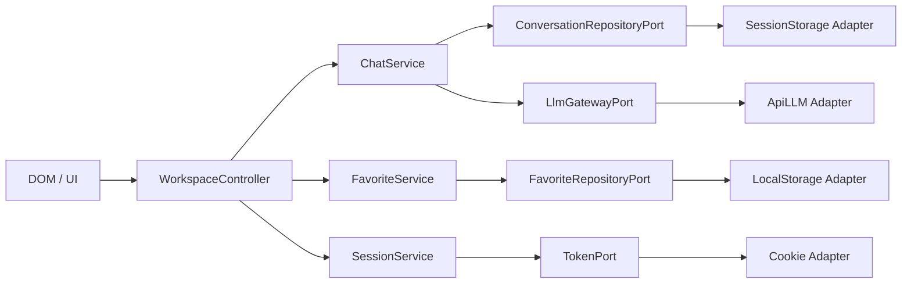

# Análisis riguroso de la práctica

## 1. Lectura técnica del problema

La aplicación modela tres estados con ciclos de vida distintos:

| Estado | Mecanismo correcto | Ciclo de vida esperado | Clave/contrato |
|---|---|---|---|
| Conversación actual | `sessionStorage` | Pestaña/sesión de navegación | `conversacion` |
| Prompts favoritos | `localStorage` | Persistente entre reinicios | `favoritos` |
| Access token | Cookie | 120 segundos | `llm_token=tk_<epochMsExpiracion>` |

La evaluación real se concentra en sincronización, persistencia selectiva, formato de datos y manejo de errores asíncronos.

## 2. Contrato inmutable de `ApiLLM`

La API exige simultáneamente:

1. Cookie llamada exactamente `llm_token`.
2. Valor compatible con `^tk_(\d+)$`.
3. El número debe representar una fecha futura en epoch milisegundos.
4. Historial no vacío.
5. Cada entrada debe ser un objeto con:
   - `rol`: `user` o `ia`.
   - `contenido`: string.
6. Sin token válido lanza `{ status: 401, ... }`.
7. Con historial inválido lanza `{ status: 422, ... }`.

Por ello, cualquier solución que altere el simulador, envíe strings o use una cookie diferente queda desacoplada de la versión del profesor.

## 3. Auditoría del borrador inicial

| Hallazgo | Fragmento/decisión incorrecta | Consecuencia | Corrección |
|---|---|---|---|
| Persistencias invertidas | Conversación en `localStorage`; favoritos en `sessionStorage` | Conversación sobrevive demasiado; favoritos se pierden | Adaptadores específicos por almacenamiento |
| DTO inválido | `conv.push(texto)` | `ApiLLM` responde 422 | Crear `{ rol, contenido }` en dominio |
| Cookie incorrecta | `document.cookie = "token=" + token` | Siempre 401 | `llm_token=tk_<epoch>` |
| Sin TTL | No usa `Max-Age` | No expira a los 2 minutos | `Max-Age=120` + `Expires` |
| Limpieza destructiva | `localStorage.clear()` | Borra favoritos | Eliminar solo `sessionStorage.conversacion` |
| UI inconsistente tras 401 | Limpia storage, pero no repinta chat | Estado visual obsoleto | Controlador repinta conversación vacía |
| Badge falso | Texto fijo “Sesión activa” | No demuestra expiración real | Temporizador derivado de epoch de cookie |
| Acoplamiento alto | Todo está en un único script | Difícil de probar y sustituir | Puertos/adaptadores + inyección |
| JSON frágil | `JSON.parse` sin recuperación | Datos corruptos rompen el arranque | Adaptador `SafeJsonStorage` |
| Sin manejo 422/general | Solo contempla 401 | Fallos silenciosos | Errores de aplicación tipados + toast |

## 4. Arquitectura elegida

### 4.1 Estilo

Se implementa arquitectura hexagonal pragmática, adecuada para una aplicación pequeña sin convertirla en una catedral corporativa para guardar tres valores.

### 4.2 Cohesión y acoplamiento

- Cada clase tiene una sola razón principal de cambio.
- Los servicios no conocen `window`, `document`, cookies ni DevTools.
- La UI no decide dónde persistir datos.
- El gateway traduce entidades a un DTO exacto.
- El simulador se inyecta; no se modifica.
- Los adaptadores pueden sustituirse por IndexedDB, API real o mocks sin reescribir los casos de uso.

## 5. Flujos críticos

### 5.1 Inicio de sesión

1. UI dispara `WorkspaceController.handleLogin()`.
2. `SessionService` solicita un token al puerto.
3. `CookieTokenAdapter` calcula `Date.now() + 120000`.
4. Crea `llm_token=tk_<epoch>` con `Max-Age=120`.
5. El controlador actualiza el badge usando el epoch real.

### 5.2 Envío exitoso

1. El dominio valida el prompt.
2. Se crea `{ rol: "user", contenido }`.
3. Se persiste en `sessionStorage` antes de la latencia.
4. El gateway genera un DTO limpio y llama `ApiLLM.enviar()`.
5. Se crea `{ rol: "ia", contenido: respuesta }`.
6. Se persiste y renderiza el historial completo.

### 5.3 Error 401

1. `ApiLLM` rechaza por token ausente, malformado o expirado.
2. `ChatService` captura el error.
3. Elimina solo la clave de conversación.
4. Lanza `SessionExpiredError` hacia el controlador.
5. La UI vacía el hilo, muestra modal y mantiene favoritos.

## 6. Decisiones de calidad

- **XSS:** todo contenido del usuario se pinta con `textContent`.
- **Accesibilidad:** labels, roles, foco visible, modal, regiones `aria-live` y reducción de movimiento.
- **Resiliencia:** JSON corrupto no bloquea el arranque.
- **Compatibilidad:** cero dependencias runtime y servidor estático simple.
- **Pruebas:** dominio, adaptadores y servicios se prueban con Node sin navegador real.
- **Integridad:** `ApiLLM` sigue congelada y separada del cliente.

## 7. Observaciones rigurosas sobre el enunciado

### 7.1 Duplicar pestaña

El enunciado supone que duplicar pestaña siempre crea un `sessionStorage` vacío. En navegadores Chromium, una pestaña duplicada puede recibir una copia inicial del almacenamiento de sesión y luego evolucionar de forma independiente. La implementación no añade detección artificial porque el requisito prohíbe código extra. Se recomienda comprobar el comportamiento en el navegador de evaluación y aclararlo con el profesor si difiere.

### 7.2 Evidencia “401 en Network”

La versión incluida de `ApiLLM` usa una promesa y lanza un objeto; no ejecuta `fetch` ni XHR. Técnicamente no genera una petición en Network. La evidencia correcta para este simulador es:

- breakpoint en `ApiLLM.enviar`,
- Console con el error capturado,
- Application mostrando cookie expirada/ausente,
- UI mostrando el modal y la limpieza selectiva.

Si la API del profesor se reemplaza por una implementación HTTP, entonces el 401 sí será visible en Network.

## 8. Trazabilidad de aceptación

| Caso de evaluación | Evidencia esperada | Implementación |
|---|---|---|
| Hilo por pestaña | `sessionStorage.conversacion` | `SessionConversationRepository` |
| Favoritos persistentes | `localStorage.favoritos` | `LocalFavoriteRepository` |
| Token 2 min | Cookie y badge | `CookieTokenAdapter` + `SessionService` |
| Contrato válido | Respuesta 200, no 422 | `Message` + `ApiLlmGateway` |
| Expiración | Modal 401 | `ChatService` + controlador |
| Conservación de favoritos | `favoritos` intacto | Limpieza selectiva |
| Modularización | Archivos y dependencias | Puertos/adaptadores |
| Bitácora | Documento con capturas | `BITACORA_DEPURACION.md` |
