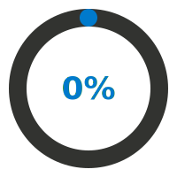

<h1 align="center">
  
</h1>

Bienvenido a mi repositorio principal para el curso ISW-521[cite: 3, 4]. Este espacio sirve como documentación de mi aprendizaje, registro de prácticas y base del proyecto integrador.

## 🎯 Objetivos

### Objetivo General
Desarrollar aplicaciones de software en ambiente web, utilizando estándares internacionales, patrones de diseño, modelos, protocolos y buenas prácticas, que permitan la visualización, manipulación y acceso seguro a fuentes externas de información desde cualquier dispositivo[cite: 20].

### Objetivo Profesional
Aplicar metodologías de la industria para crear interfaces web de alta calidad, gestionando eficientemente librerías, frameworks del lado del cliente y consumiendo servicios web mediante el intercambio de datos en arquitecturas REST.

### Objetivo Personal
Dominar el ecosistema de desarrollo web moderno, asegurando un entendimiento profundo del ciclo de vida de las peticiones HTTP, el tipado estricto con TypeScript, y la creación de interfaces accesibles y totalmente responsivas.

---

## 🛠 Tecnologías Usadas

  
  
  
  
  
  
  

---

## 🗺 Roadmap de Aprendizajes

- [ ] **Unidad I: Componentes de las aplicaciones web.** Protocolos HTTP/HTTPS, configuración de CORS, control de versiones con Git/GitHub, y tooling moderno como npm, yarn y Vite.
- [ ] **Unidad II: Estructura y Diseño de Aplicaciones Web.** Diseño responsivo (Mobile-first), accesibilidad Web (WCAG 2.1), maquetación con Flexbox, CSS Grid y sistemas de diseño.
- [ ] **Unidad III: Lenguaje de scripting.** JavaScript ES6+ moderno, manipulación del DOM, programación asíncrona (Promises, async/await), y herramientas de debugging del navegador.
- [ ] **Unidad IV: Librerías y frameworks.** Integración de TypeScript, manejo de variables de entorno, anatomía del JWT, prevención de XSS y CSRF, y testing con Jest/Vitest y Testing Library.
- [ ] **Unidad V: Interoperabilidad con servicios.** Consumo y respuesta de solicitudes (sincrónicas/asincrónicas), semántica HTTP (REST), JSON como contrato de datos y manejo del estado global.

### 📚 Detalle de Competencias y Estándares

  
<b>🌐 Infraestructura y Herramientas de Desarrollo</b>

  <ul>
    <li><b>Protocolos y Red:</b> TCP/IP, HTTP, HTTPS, TLS, DNS, resolución de peticiones y CORS.</li>
    <li><b>Servidores:</b> Host, puertos y arquitectura Serverless.</li>
    <li><b>Control de Versiones:</b> Git, GitHub, ramas, Pull Requests y resolución de conflictos.</li>
    <li><b>Tooling:</b> Vite, npm, yarn, package.json y Node.js.</li>
  </ul>

  
<b>🎨 Estructura, Diseño Web y Accesibilidad</b>

  <ul>
    <li><b>Maquetación:</b> HTML5 Semántico, CSS3, Flexbox y CSS Grid.</li>
    <li><b>Diseño Adaptativo:</b> Mobile-first, Media Queries y Viewport.</li>
    <li><b>Sistemas y Estándares:</b> Variables CSS, SASS/SCSS, y fundamentos de Tailwind/Bootstrap.</li>
    <li><b>Accesibilidad:</b> Estándares WCAG 2.1, principios POUR, roles ARIA y navegación por teclado.</li>
  </ul>

  
<b>⚙️ Lógica de Cliente y APIs del Navegador</b>

  <ul>
    <li><b>JavaScript Moderno (ES6+):</b> Destructuring, spread/rest, optional chaining, nullish coalescing y ESModules.</li>
    <li><b>APIs Nativas:</b> Manipulación del DOM, BOM, Geolocation API y manejo de eventos.</li>
    <li><b>Asincronismo:</b> Promises, async/await y Fetch API.</li>
    <li><b>Persistencia y Rendimiento:</b> localStorage, sessionStorage, Cookies, DevTools y Lighthouse.</li>
  </ul>

  
<b>🛡️ Frameworks, Tipado, Seguridad y Servicios Web</b>

  <ul>
    <li><b>Tipado Estricto:</b> TypeScript (interfaces, genéricos, decoradores y tsconfig.json).</li>
    <li><b>Seguridad:</b> JSON Web Tokens (JWT), mitigación de XSS y CSRF, y uso de archivos .env.</li>
    <li><b>Interoperabilidad:</b> Arquitectura REST, semántica HTTP, JSON y consumo con Axios/Fetch.</li>
    <li><b>Estado y Testing:</b> Context API, conceptos de caché remota y pruebas automatizadas con Jest/Vitest.</li>
  </ul>

---

## 📈 Progreso y Estadísticas

<table width="100%">
  <tr>
    <td width="50%" align="center">
      <b>Tracker de Commits</b>  
      
    </td>
    <td width="50%" align="center">
      <b>Avance del Curso</b> 
      <i>(Se actualiza automáticamente los Martes y Jueves)</i>  
      
    </td>
  </tr>
</table>
